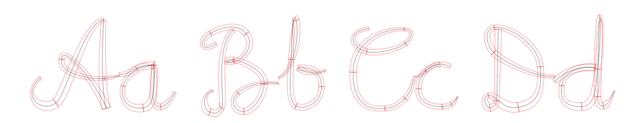
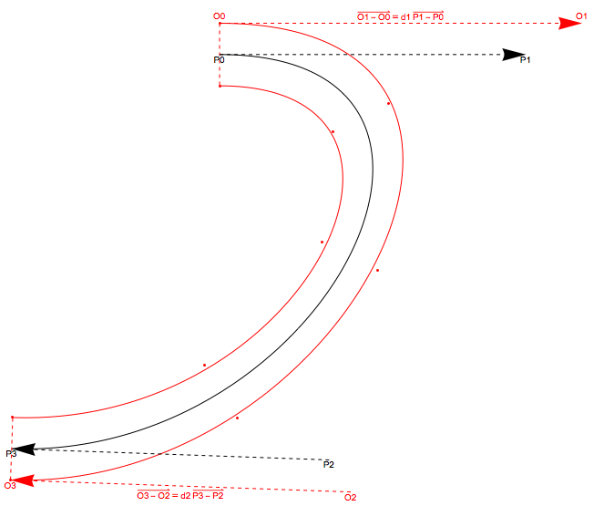

# Generate Handwriting Documents


This repository contains an application for generating realistic handwriting documents.

## Not Just a Cursive Font
It is not just another cursive font. The goal is to generate documents with a more authenticate feeling. Each character will be rendered differently in the following ways:
1. Adjacent strokes of two characters will be bent and joined up if possible.
2. Random perturbation to make the same character look slightly different each time.
3. Continuous increase of thickness and slackness of the characters.
4. Random perturbation to make letters not always perfectly aligned.

## Run a local instance
```
npm start
```

## Implementation

### Font Format
The strokes of each character are described by a series of cubic Bezier curves, so they can be easily manipulated by changing their control points.


Each Bezier curve is called _segment_ and is the smallest unit during font rendering. A single stroke may be divided into segments for a more accurate representation of its shape.

However, this representation lost the variation of stroke thickness, resulting in a very boring font style. When generating the font file, the starting and ending thickness of each segment is also recorded. During rendering, the thickness of each point in a segment is linearly interpolated from its two ends.



### Determining the Contour Curve

The contour curves should have roughly the same flow as the outline curve and the distance between the two curves should correspond to the width information of the two ends. These two curves should also be well approximated with a Bezier curve.
A straightforward idea is to sample the contour curves and perform a least square fitting.
However, the end points and their slopes should be the same with the outline curves. Adding this two conditions, the number of parameters we need to fit is reduced to two.


